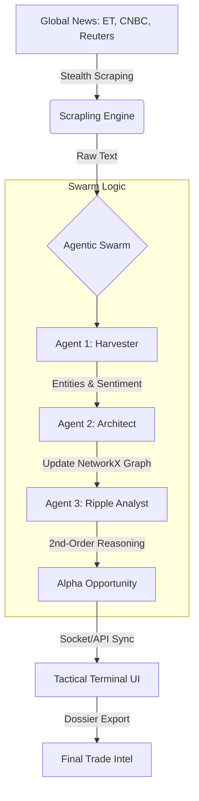

# S.O.M.I.S Architecture: AI for the Indian Investor (Opportunity Radar)

## 1. System Overview
**S.O.M.I.S (Second-Order Market Impact Swarm)** is a multi-agent system designed to identify non-obvious trading opportunities for the Indian Investor by tracing "Ripple Effects" through a deep knowledge graph. It is built on a **Local-First** philosophy, ensuring 100% data privacy and zero operational costs.

## 2. Process Flow (Mermaid Diagram)

## 3. The Agentic Swarm (CrewAI)
The system employs three specialized agents with distinct roles and backstories:

| Agent | Role | Responsibility |
| :--- | :--- | :--- |
| **Harvester** | Financial Intelligence | Ingests news headlines and extracts structured data (Tickers, Sectors, Impact Scores). |
| **Architect** | Graph Master | Maps the news event onto the `NetworkX` Supply Chain graph to find immediate victims/beneficiaries. |
| **Ripple Analyst**| Alpha Generator | Traces the 1st-order connections to 2nd-order "hidden" winners. Generates the final reasoning chain. |

## 4. Technical Stack
*   **Orchestration:** CrewAI (Manages agent roles, task sequencing, and delegation).
*   **The Brain:** Phi-3.5-Mini (3.8B) running locally via **KoboldCpp** (OpenAI-compatible API).
*   **Data Ingestion:** **Scrapling** (Stealth engine) for bypassing JA3/HTTP2 protections on financial news sites.
*   **Knowledge Layer:** **NetworkX** (Directed Graph) for high-speed in-memory supply chain modeling.
*   **UI/UX:** React + Vite + Framer Motion (High-density tactical dashboard).

## 5. Error Handling & Robustness
S.O.M.I.S is designed for "Mission-Critical" reliability during a demo:
1.  **Zero-Fallback Mandate:** The system is configured to wait indefinitely (120s+) for the local LLM to finish reasoning, ensuring every alert is 100% AI-generated.
2.  **Pre-Flight Reachability:** The backend performs an `httpx` check on the local LLM before initiating the swarm, logging "OFFLINE" status if the model isn't ready.
3.  **Parallel Scraper Timeout:** Each scraper (ET, CNBC, Reuters) runs in its own thread with a 10s timeout to prevent a single hung website from freezing the UI.
4.  **Optimistic UI Deletion:** Alert dismissals are removed from the frontend instantly while backend cleanup happens asynchronously, preventing UI jitter.

## 6. Key Innovation: Ripple Reasoning
Unlike standard RAG systems that summarize news, S.O.M.I.S uses **Forward-Link Reasoning**. It doesn't just ask "What happened?"; it asks "Who is connected to what happened that the market hasn't noticed yet?" 

---
**Created for ET AI Hackathon 2026 | Submission #6: AI for the Indian Investor**
